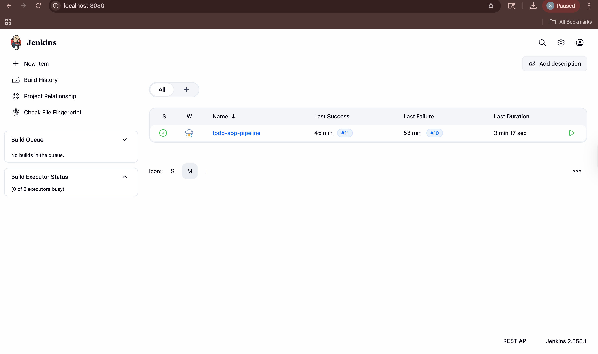
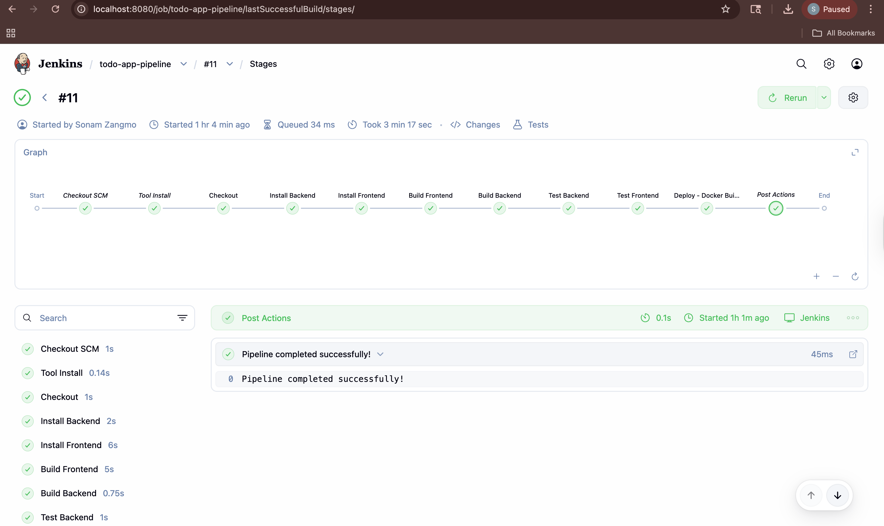
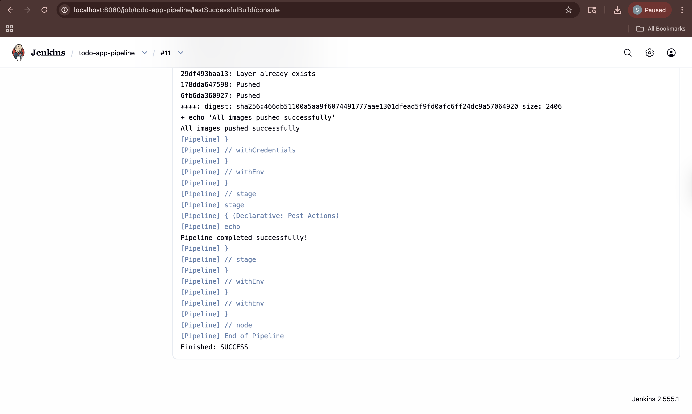
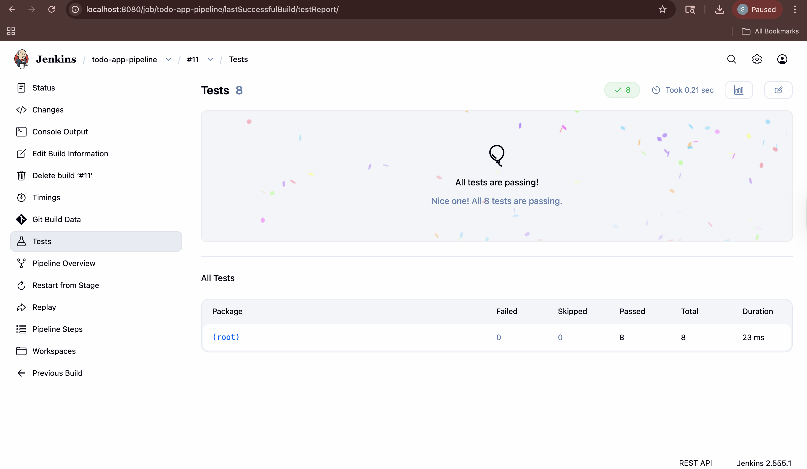
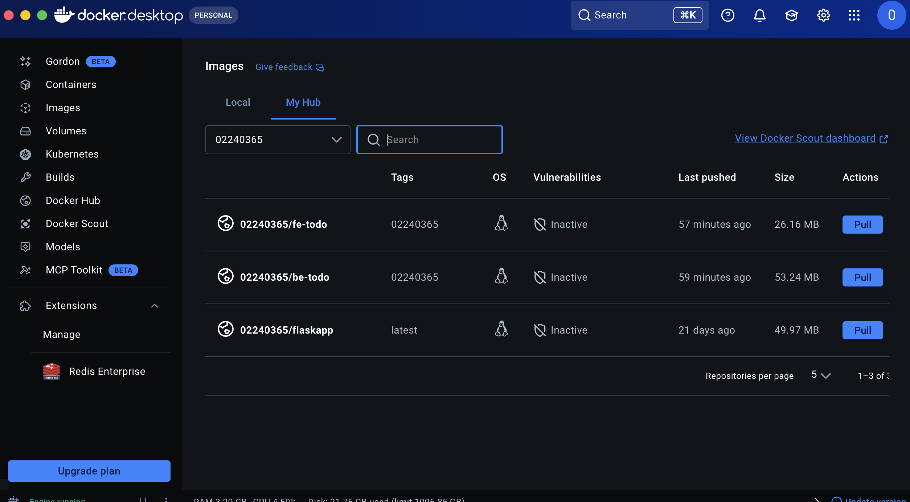
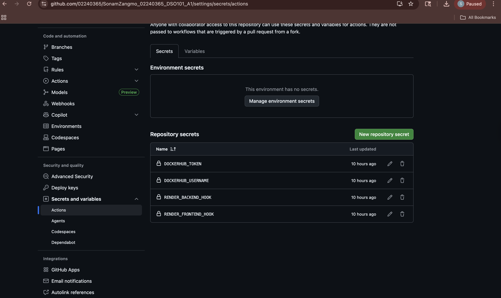
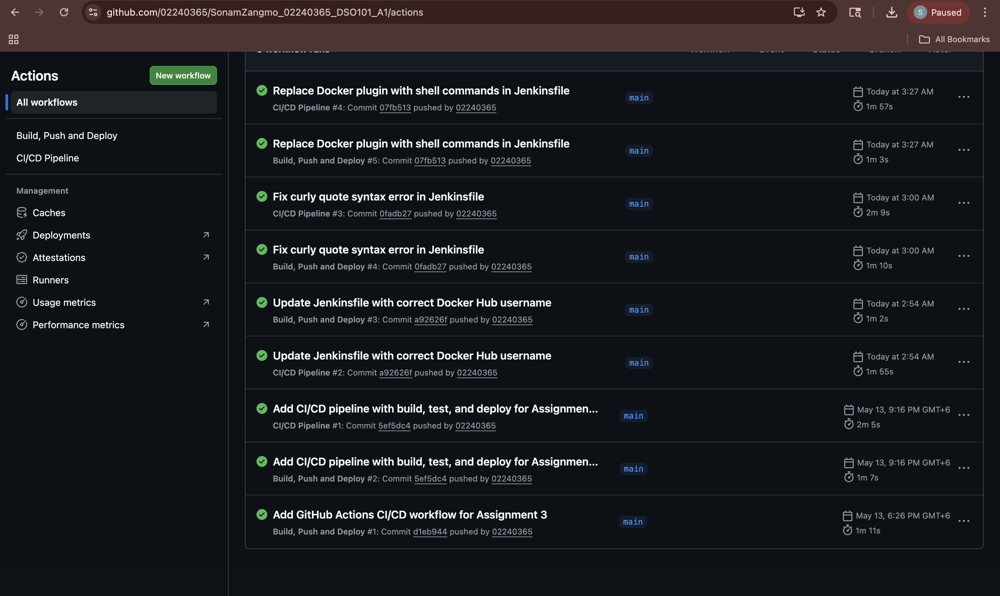
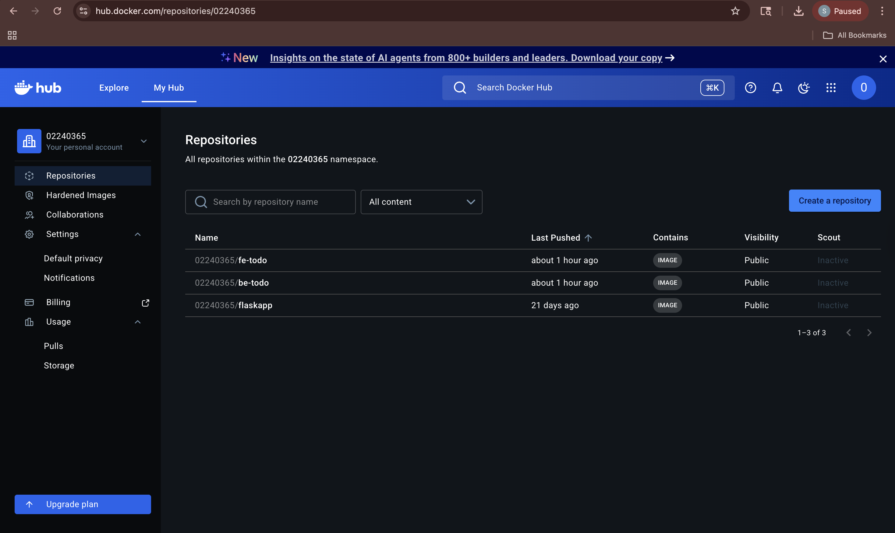
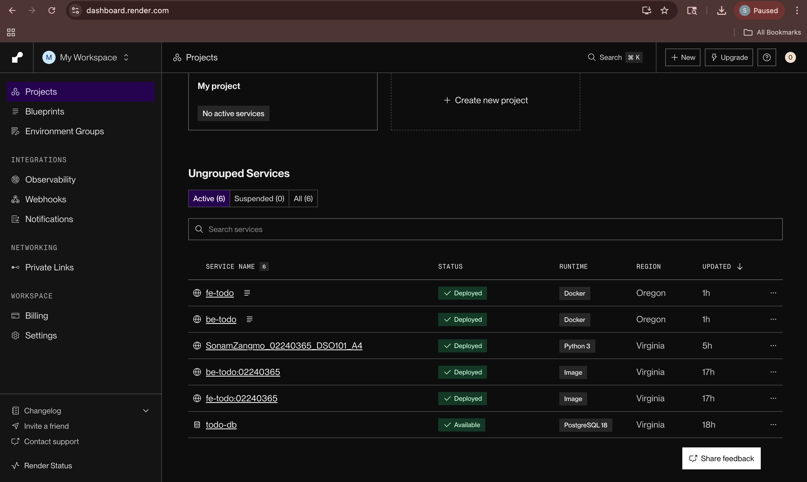

# Reports for Assignments 1, 2 and 3

# Assignment 1 - CI/CD: Docker & Render Deployment

**Name:** Sonam Zangmo  
**Student ID:** 02240365  
**Course:** DSO101 - Continuous Integration and Continuous Deployment

---

## Project Overview

A full-stack To-Do List web application deployed using Docker and Render.com.

**Tech Stack:** React (Frontend) · Node.js + Express (Backend) · PostgreSQL (Database)

---

## Folder Structure

```
SonamZangmo_02240365_DSO101_A1/
└── todo-app/
    ├── backend/          # Node.js Express API
    ├── frontend/         # React App
    └── render.yaml       # Blueprint config
```

---

## Step 0 — Local Setup

### Backend
```bash
cd todo-app/backend
cp .env.example .env   # fill in DB credentials
npm install
npm start
```

### Frontend
```bash
cd todo-app/frontend
cp .env.example .env   # set REACT_APP_API_URL=http://localhost:5001
npm install
npm start
```

📸 **Terminal showing backend running on port 5001**


📸 **Browser showing app at http://localhost:3000**


---

## Part A — Docker Hub Deployment

### Build & Push Backend
```bash
docker build --platform linux/amd64 -t YOUR_USERNAME/be-todo:02240365 ./todo-app/backend
docker push YOUR_USERNAME/be-todo:02240365
```

### Build & Push Frontend
```bash
docker build --platform linux/amd64 -t YOUR_USERNAME/fe-todo:02240365 ./todo-app/frontend
docker push YOUR_USERNAME/fe-todo:02240365
```

📸 **Docker Hub showing both be-todo and fe-todo repositories**


### Deploy on Render

1. Render → New → Web Service → Existing Image
2. Backend image: `YOUR_USERNAME/be-todo:02240365`
3. Add environment variables (DB_HOST, DB_USER, DB_PASSWORD, DB_NAME, DB_PORT, PORT)
4. Repeat for frontend with `REACT_APP_API_URL` pointing to backend URL

📸 **Render backend service showing Live status and URL**


📸 **Live frontend app in browser**


---

## Part B — Blueprint CI/CD (render.yaml)

Repository connected to Render via Blueprint. Every git push triggers automatic rebuild and deployment of both services.

```bash
git push  # triggers auto-deploy on Render
```

📸 **Render Blueprint showing both services deployed**


---

## Live URLs

- **Frontend:** https://fe-todo-02240365.onrender.com
- **Backend:** https://be-todo-02240365.onrender.com
- **GitHub Repo:** https://github.com/02240365/SonamZangmo_02240365_DSO101_A1.git

---

# Assignment 2 - Jenkins CI/CD Pipeline

**Name:** Sonam Zangmo  
**Student ID:** 02240365  
**Course:** DSO101 - Continuous Integration and Continuous Deployment

---

## Overview

Configured a Jenkins pipeline to automate build, test, and deployment of the To-Do List app from Assignment 1.

---

## Pipeline Stages

| Stage | Description |
|-------|-------------|
| Checkout | Pulls code from GitHub |
| Install Backend | Runs `npm install` in backend |
| Install Frontend | Runs `npm install` in frontend |
| Build Frontend | Compiles React app |
| Build Backend | Confirms backend is ready |
| Test Backend | Runs 8 Jest unit tests |
| Test Frontend | Runs 9 Jest unit tests |
| Deploy | Builds & pushes Docker images |

---

## How the Pipeline Was Configured

1. Installed Jenkins via Homebrew on Mac (`brew install jenkins-lts`)
2. Installed plugins: NodeJS, Pipeline, GitHub Integration, Docker Pipeline
3. Configured NodeJS tool in Manage Jenkins → Tools (name: `NodeJS`)
4. Added GitHub credentials (ID: `github-creds`) using Personal Access Token
5. Added Docker Hub credentials (ID: `docker-hub-creds`)
6. Created Pipeline job pointing to `Jenkinsfile` in GitHub repo
7. Tests use Jest with mocked PostgreSQL — no real DB needed in CI

📸 **Jenkins dashboard**



📸 **Pipeline stages view showing all stages green**



📸 **Console output showing 8 backend tests passed + 9 frontend tests passed**



📸 **Jenkins Test Results page**



📸 **Docker Hub showing be-todo and fe-todo images**



---

## Test Results

**Backend (Jest + Supertest):** 8 tests passed
- GET /health, GET /api/tasks, POST /api/tasks, PUT /api/tasks/:id, DELETE /api/tasks/:id

**Frontend (Jest):** 9 tests passed
- Task structure, filter logic, toggle, delete, API URL validation

---

## Challenges Faced

- **Curly quotes:** TextEdit auto-corrected quotes in Jenkinsfile causing syntax errors. Fixed by using nano instead.
- **Docker not found:** Jenkins couldn't find Docker binary. Fixed by adding `/usr/local/bin` to Jenkins PATH and using full Docker path in shell commands.
- **Database in tests:** Backend connects to PostgreSQL on startup. Fixed by mocking `pg` in Jest tests so no real DB is needed.

---

## GitHub Repo

https://github.com/02240365/SonamZangmo_02240365_DSO101_A1.git

---

# Assignment 3 - GitHub Actions CI/CD

**Name:** Sonam Zangmo  
**Student ID:** 02240365  
**Course:** DSO101 - Continuous Integration and Continuous Deployment

---

## Overview

Configured a GitHub Actions workflow to automatically build Docker images, push to Docker Hub, and deploy to Render.com on every git push.

---

## Workflow File

`.github/workflows/deploy.yml`

**Triggers:** Every push to `main` branch

**Steps:**
1. Checkout code
2. Login to Docker Hub
3. Build & push backend image (`be-todo:02240365`)
4. Build & push frontend image (`fe-todo:02240365`)
5. Trigger backend redeployment on Render via webhook
6. Trigger frontend redeployment on Render via webhook

---

## GitHub Secrets Used

| Secret | Purpose |
|--------|---------|
| `DOCKERHUB_USERNAME` | Docker Hub login |
| `DOCKERHUB_TOKEN` | Docker Hub access token |
| `RENDER_BACKEND_HOOK` | Render deploy webhook for backend |
| `RENDER_FRONTEND_HOOK` | Render deploy webhook for frontend |

📸 **GitHub → Settings → Secrets showing all 4 secrets**


---

## Steps Taken

1. Created `.github/workflows/deploy.yml` in the repository
2. Generated Docker Hub Access Token (Account Settings → Security)
3. Got Render Deploy Hook URLs (Render → Service → Settings → Deploy Hook)
4. Added all 4 secrets to GitHub repository settings
5. Pushed code → workflow triggered automatically

📸 **GitHub Actions tab showing workflow running**



📸 **Docker Hub showing be-todo and fe-todo with updated push date**



📸 **Render showing new deployment triggered by GitHub Actions**



---

## Challenges Faced

- **Render does not auto-redeploy** when a new Docker image is pushed to Docker Hub. Solved by calling the Render Deploy Hook URL using `curl` inside the workflow.
- **Dockerfile path:** Since Dockerfiles are inside subfolders (`todo-app/backend`), the build context path had to be explicitly set in the workflow commands.

---

## Learning Outcomes

- How to write GitHub Actions YAML workflow files
- How to store secrets securely in GitHub (never hardcode credentials)
- Difference between Docker Hub push and Render deployment (they are separate steps)
- How to chain build → push → deploy automatically on every git push

---

## Live Deployment

- **Frontend:** https://fe-todo-02240365.onrender.com
- **Backend:** https://be-todo-02240365.onrender.com 
- **GitHub Repo:** https://github.com/02240365/SonamZangmo_02240365_DSO101_A1.git
