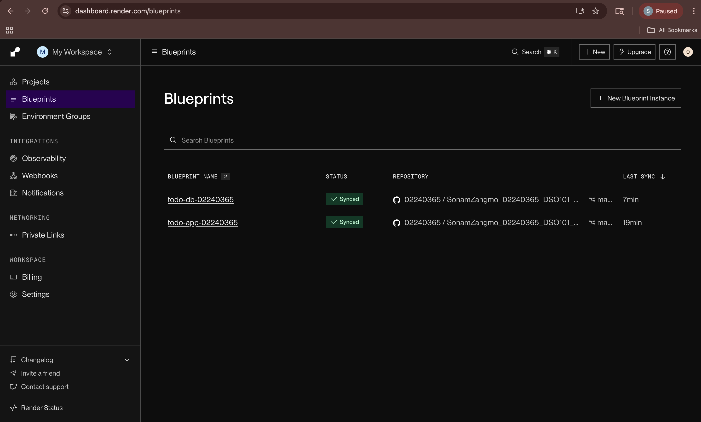

# Assignment 1 — CI/CD: Docker & Render Deployment

**Name:** Sonam Zangmo  
**Student ID:** 02240365  
**Course:** DSO101 — Continuous Integration and Continuous Deployment

---

## Project Overview

A full-stack To-Do List web application deployed using Docker and Render.com.

**Tech Stack:** React (Frontend) · Node.js + Express (Backend) · PostgreSQL (Database)

---

## Folder Structure

```
SonamZangmo_02240365_DSO101_A1/
└── todo-app/
    ├── backend/          # Node.js Express API
    ├── frontend/         # React App
    └── render.yaml       # Blueprint config
```

---

## Step 0 — Local Setup

### Backend
```bash
cd todo-app/backend
cp .env.example .env   # fill in DB credentials
npm install
npm start
```

### Frontend
```bash
cd todo-app/frontend
cp .env.example .env   # set REACT_APP_API_URL=http://localhost:5000
npm install
npm start
```

📸 **Terminal showing backend running on port 5000**


📸 **Browser showing app at http://localhost:3000**


---

## Part A — Docker Hub Deployment

### Build & Push Backend
```bash
docker build --platform linux/amd64 -t YOUR_USERNAME/be-todo:02240365 ./todo-app/backend
docker push YOUR_USERNAME/be-todo:02240365
```

### Build & Push Frontend
```bash
docker build --platform linux/amd64 -t YOUR_USERNAME/fe-todo:02240365 ./todo-app/frontend
docker push YOUR_USERNAME/fe-todo:02240365
```

📸 **Docker Hub showing both be-todo and fe-todo repositories**


### Deploy on Render

1. Render → New → Web Service → Existing Image
2. Backend image: `YOUR_USERNAME/be-todo:02240365`
3. Add environment variables (DB_HOST, DB_USER, DB_PASSWORD, DB_NAME, DB_PORT, PORT)
4. Repeat for frontend with `REACT_APP_API_URL` pointing to backend URL

📸 **Render backend service showing Live status and URL**


📸 **Live frontend app in browser**


---

## Part B — Blueprint CI/CD (render.yaml)

Repository connected to Render via Blueprint. Every git push triggers automatic rebuild and deployment of both services.

```bash
git push  # triggers auto-deploy on Render
```

📸 **Render Blueprint showing both services deployed**



---

## Live URLs

- **Frontend:** https://fe-todo-02240365.onrender.com
- **Backend:** https://be-todo-02240365.onrender.com
- **GitHub Repo:** https://github.com/02240365/SonamZangmo_02240365_DSO101_A1.git
