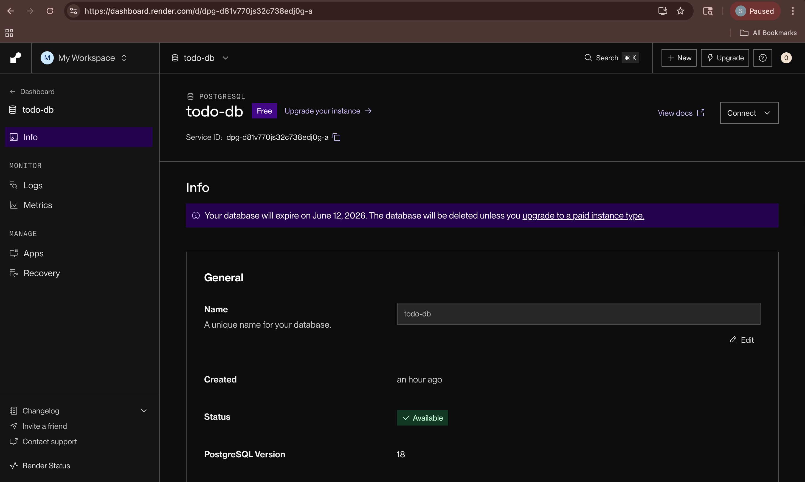
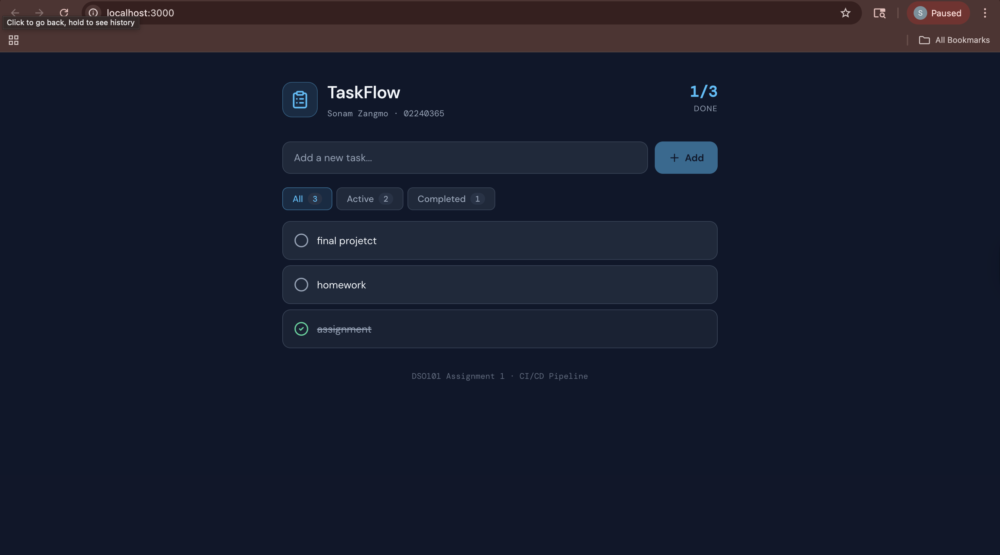

# TaskFlow — To-Do List Web Application

**Student:** Sonam Zangmo  
**Student ID:** 02240365  
**Course:** DSO101 — Continuous Integration and Continuous Deployment  
**Assignment:** Assignment 1

---

## Project Overview

TaskFlow is a full-stack To-Do List web application built with React (frontend), Node.js + Express (backend), and PostgreSQL (database). The project demonstrates:

- Local full-stack development with environment variables
- Dockerization of frontend and backend services
- Deployment to Docker Hub registry
- Cloud deployment on Render.com
- Automated CI/CD pipeline using GitHub + Render Blueprint

---

## Tech Stack

| Layer     | Technology                        |
|-----------|-----------------------------------|
| Frontend  | React 18, Lucide React (icons)    |
| Backend   | Node.js, Express                  |
| Database  | PostgreSQL (Render managed)       |
| Container | Docker, Nginx (frontend serving)  |
| CI/CD     | GitHub + Render Blueprint         |
| Hosting   | Render.com (free plan)            |

---

## Folder Structure

```
sonamzangmo_02240365_DSO101_A1/
└── todo-app/
    ├── backend/
    │   ├── server.js
    │   ├── package.json
    │   ├── Dockerfile
    │   ├── .env.example
    │   ├── .env.production
    │   └── .gitignore
    ├── frontend/
    │   ├── public/
    │   │   └── index.html
    │   ├── src/
    │   │   ├── App.js
    │   │   ├── App.css
    │   │   ├── index.js
    │   │   └── index.css
    │   ├── package.json
    │   ├── Dockerfile
    │   ├── nginx.conf
    │   ├── .env.example
    │   ├── .env.production
    │   └── .gitignore
    ├── render.yaml
    ├── .gitignore
    └── README.md
```

---

---

## Local Setup

### Prerequisites

- Node.js 18+ installed
- PostgreSQL running locally (or use Render DB)
- Git installed
- Docker Desktop installed

### Step 1 — Clone the Repository

Open Mac Terminal:

```bash
git clone https://github.com/02240365/SonamZangmo_02240365_DSO101_A1.git
cd sonamzangmo_02240365_DSO101_A1/todo-app
```

### Step 2 — Set Up Backend

```bash
cd backend
cp .env.example .env
```

Edit `.env` with your database credentials:

```env
DB_HOST=localhost
DB_USER=your_pg_user
DB_PASSWORD=your_pg_password
DB_NAME=todo_db
DB_PORT=5432
PORT=5000
```

Install dependencies and start:

```bash
npm install
npm start
```

Backend will run at: `http://localhost:5000`

**Backend Running Successfully:**


### Step 3 — Set Up Frontend

Open a new terminal tab:

```bash
cd frontend
cp .env.example .env
```

`.env` content:

```env
REACT_APP_API_URL=http://localhost:5000
```

Install and start:

```bash
npm install
npm start
```

Frontend will open at: `http://localhost:3000`

**Frontend Application Running:**


### Step 4 — Test the App

- Add a task using the input field
- Mark a task as complete by clicking the circle icon
- Edit a task using the pencil icon
- Delete a task using the trash icon
- Use the filter tabs (All / Active / Completed)

---

## Step 0 — Database Setup (Render PostgreSQL)

1. Go to [https://render.com](https://render.com) and sign in
2. Click **New** → **PostgreSQL**
3. Set name: `todo-db`, select **Free** plan
4. Click **Create Database**
5. Copy the connection credentials (Internal DB URL or individual fields)

**PostgreSQL Database Configuration:**



Use these credentials in your backend `.env` file.

---

## Part A — Docker Hub Deployment

### Step 1 — Build Backend Docker Image

Open Mac Terminal, navigate to `todo-app/backend`:

```bash
cd backend
docker build -t YOUR_DOCKERHUB_USERNAME/be-todo:02240365 .
```

**Backend Docker Image Build:**


### Step 2 — Push Backend Image

```bash
docker push YOUR_DOCKERHUB_USERNAME/be-todo:02240365
```

**Backend Image Successfully Built and Tagged:**


### Step 3 — Build Frontend Docker Image

```bash
cd ../frontend
docker build -t YOUR_DOCKERHUB_USERNAME/fe-todo:02240365 .
```

**Frontend Application Docker Container:**



### Step 4 — Push Frontend Image

```bash
docker push YOUR_DOCKERHUB_USERNAME/fe-todo:02240365
```

All images are now available on Docker Hub for deployment.

### Step 5 — Deploy Backend on Render

1. Go to Render → **New** → **Web Service**
2. Select **Deploy an existing image from a registry**
3. Image URL: `docker.io/YOUR_DOCKERHUB_USERNAME/be-todo:02240365`
4. Set environment variables:

| Key           | Value                          |
|---------------|-------------------------------|
| DB_HOST       | your-render-db-host           |
| DB_USER       | your-db-user                  |
| DB_PASSWORD   | your-db-password              |
| DB_NAME       | your-db-name                  |
| DB_PORT       | 5432                          |
| PORT          | 5000                          |

5. Click **Create Web Service**

**Backend Health Check on Render:**


**Render Backend Service Configuration:**


### Step 6 — Deploy Frontend on Render

1. Go to Render → **New** → **Web Service**
2. Select **Deploy an existing image from a registry**
3. Image URL: `docker.io/YOUR_DOCKERHUB_USERNAME/fe-todo:02240365`
4. Set environment variable:

| Key                  | Value                                |
|----------------------|--------------------------------------|
| REACT_APP_API_URL    | https://be-todo.onrender.com         |

5. Click **Create Web Service**

**Frontend Live Application:**


---

## Part B — Automated CI/CD with GitHub + Render Blueprint

### Step 1 — Create GitHub Repository

1. Go to [https://github.com](https://github.com)
2. Click **New Repository**
3. Name it: `sonamzangmo_02240365_DSO101_A1`
4. Keep it Public, click **Create**

### Step 2 — Push Code to GitHub

In Mac Terminal, from the root of the project:

```bash
cd sonamzangmo_02240365_DSO101_A1
git init
git add .
git commit -m "Initial commit: Full-stack To-Do app with Docker setup"
git branch -M main
git remote add origin https://github.com/YOUR_USERNAME/sonamzangmo_02240365_DSO101_A1.git
git push -u origin main
```

### Step 3 — Update render.yaml

Edit `todo-app/render.yaml` with your actual DB values before pushing. The file is already configured for multi-service deployment:

```yaml
services:
  - type: web
    name: be-todo
    env: docker
    dockerfilePath: ./backend/Dockerfile
    plan: free
    envVars:
      - key: DB_HOST
        value: YOUR_RENDER_DB_HOST
      ...

  - type: web
    name: fe-todo
    env: docker
    dockerfilePath: ./frontend/Dockerfile
    plan: free
    envVars:
      - key: REACT_APP_API_URL
        value: https://be-todo.onrender.com
```

### Step 4 — Deploy Blueprint on Render

1. Go to Render → **New** → **Blueprint**
2. Connect your GitHub account
3. Select the `sonamzangmo_02240365_DSO101_A1` repository
4. Render will detect `render.yaml` automatically
5. Click **Apply**

### Step 5 — Verify Auto-Deploy (CI/CD)

Make any small change to the code, then push to GitHub:

```bash
git add .
git commit -m "Test auto-deploy trigger"
git push
```

Render will automatically rebuild and redeploy both services.

**Health Check Verification:**


---

## Troubleshooting

| Problem | Solution |
|--------|---------|
| Backend can't connect to DB | Check `.env` DB credentials match Render PostgreSQL dashboard |
| Frontend shows blank page | Ensure `REACT_APP_API_URL` is set correctly and backend is live |
| Docker build fails | Make sure Docker Desktop is running before any `docker` command |
| Render deployment stuck | Check logs in Render dashboard → your service → Logs tab |
| CORS error in browser | Backend `cors()` middleware is already enabled; verify API URL matches |
| `node_modules` pushed to Git | Ensure `.gitignore` contains `node_modules/` in each folder |
| `.env` committed by mistake | Never commit `.env`; use `.env.example` as reference template |

---

## API Endpoints Reference

| Method | Endpoint        | Description          |
|--------|-----------------|----------------------|
| GET    | /api/tasks      | Get all tasks        |
| POST   | /api/tasks      | Create a new task    |
| PUT    | /api/tasks/:id  | Update a task        |
| DELETE | /api/tasks/:id  | Delete a task        |
| GET    | /health         | Health check         |

---

## Live URLs

> Replace with your actual URLs after deployment

- **Frontend (Part A):** `https://fe-todo.onrender.com`
- **Backend API (Part A):** `https://be-todo-02240365.onrender.com`
- **Frontend (Part B Blueprint):** `https://fe-todo-xxxx.onrender.com`
- **Docker Hub Backend:** `https://hub.docker.com/r/YOUR_USERNAME/be-todo`
- **Docker Hub Frontend:** `https://hub.docker.com/r/YOUR_USERNAME/fe-todo`

---

*DSO101 Assignment 1 — Sonam Zangmo (02240365)*
